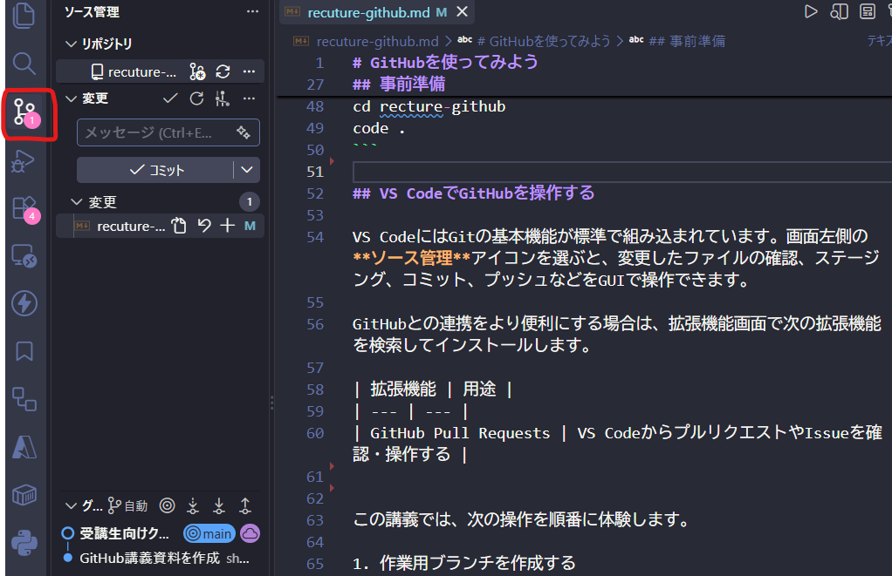

# GitHubを使ってみよう

## 今回学ぶこと

今回は、バージョン管理ツールである **GitHub** の基本操作を学びます。

講義後にできるようになることは、次の3つです。

- GitHubの初期化方法がわかる
- VSCodeのGitHub拡張機能を使用したGitHubの各種操作がわかる
- GitHubを使用したチーム開発のフローがわかる

## なぜGitHubを使うのか

GitHubは、Gitで記録したファイルの変更履歴をオンラインで共有し、チームで安全に作業するためのサービスです。Gitが手元のPCで変更履歴を管理する仕組み、GitHubがその履歴を共有・レビューする場所、と区別して覚えましょう。

GitHubを使う主なメリットは次のとおりです。

- **変更履歴を残せる**: 誰が、いつ、何を変更したのかを確認できる
- **元の状態に戻せる**: 問題が起きたときに過去の状態と比較・復元できる
- **レビューできる**: プルリクエストを使って、変更を反映する前に内容を確認できる
- **同時に作業できる**: ブランチを分けることで、複数人が互いの作業を妨げずに変更できる
- **自動化につなげられる**: GitHub Actionsを使ってテストやデプロイを実行できる

インフラエンジニアも、Terraform、Ansible、Kubernetesの設定ファイルや、手順書、スクリプトなどを日常的に扱います。これらをGitHubで管理すれば、インフラ変更もアプリケーション開発と同じように、履歴を残しながらレビューできます。

## 事前準備

ハンズオンを始める前に、次の準備を行います。

1. [GitHub](https://github.com/)でアカウントを作成し、サインインする
2. [Git公式サイト](https://git-scm.com/downloads)からGitをインストールする
3. VS Codeをインストールする[前回講義資料参照](https://github.com/shuhei0720/recuture-vscode/blob/main/recuture-vscode.md)

4. 講義用リポジトリをPCへクローンする

初めてGitを使う場合は、コミットに記録する名前とメールアドレスも設定します。メールアドレスはGitHubアカウントに登録したものを使用してください。

```powershell
git config --global user.name "あなたの名前"
git config --global user.email "あなたのメールアドレス"
```

続いて、ターミナルで次のコマンドを実行し、講義用リポジトリをクローンします。実行後、VSCodeが開きます。

```powershell
git clone https://github.com/shuhei0720/recture-github.git
cd recture-github
code .
```

## VS CodeでGitHubを操作する

VS CodeにはGitの基本機能が標準で組み込まれています。画面左側の**ソース管理**アイコンを選ぶと、変更したファイルの確認、ステージング、コミット、プッシュなどをGUIで操作できます。




この講義では、次の操作を順番に体験します。

1. 作業用ブランチを作成する
2. ファイルを変更する
3. 変更内容を確認してコミットする
4. ブランチをGitHubへプッシュする
5. プルリクエストを作成し、レビュー後にマージする

## GitHubを使用した変更管理フロー

GitHubを使用した変更管理フローを実際にどうやるか見ていきましょう。

### Branch→PR→Reviewフロー

GitHubを使ったよくある変更フローを図で見ていきましょう。


このように基本的にはすべての変更作業が、ブランチ作成→コード変更→コミット・プッシュ→プルリクエスト→承認→マージという共通の流れをたどっていくことになります。

---

### 変更管理ハンズオン

それでは、ハンズオンで変更作業の一連の流れを体験してみましょう。


VSCodeとGitHub拡張機能を使用してGitHub開発を体験してみます。

#### ブランチ作成、コード更新

まずブランチを作成します。

VSCodeの画面で、左側の枝みたいなアイコンを押すと「GitHub拡張機能」の画面が開きます。この画面でGitのほぼすべての操作がGUIでできてしまいます。


特に下部のグラフというところはこれまでの変更履歴が木のような形で記録されています。

絵もかいてみましたが、mainとブランチという概念の理解が必要です。mainが木の幹のようなものでこれまでの変更履歴をきれいに一直線に記録しています。ブランチが木の枝のようなもので、mainから離れて機能などを開発し、あとからmainと統合（マージ）します。


それでは、ブランチを作ってみましょう！グラフのところに枝みたいなのができますよ。

「その他の操作」→「ブランチ」→「ブランチの作成」を押してください。


するとブランチ名の入力画面が表示されます。ほかの受講生と重複しないように、`自分のユーザー名-practice`（例: `shuhei-practice`）と入力してEnterキーを押しましょう。

画面に表示されていたブランチ名が`main`から作成したブランチ名に変われば、ブランチの作成と切り替えは完了です。


次に、ほかの受講生とファイル名が重複しないように、`自分のユーザー名.txt`（例: `shuhei.txt`）というファイルを追加します。ファイルには、講義で学んだことを1行入力して保存しましょう。


Github拡張機能に戻ると、「変更」欄に追加したファイルが表示されています。

#### コミット、プッシュ

✨ボタンを押してAIにコミットメッセージを生成してもらい、「コミット」を押してコミットしてみましょう。


すると、作成した作業用ブランチが進んだことがわかります。`main`から分岐して変更履歴が追加されています。


次に、ブランチをリモートにプッシュしてみましょう。


以下のような確認画面が出ますが、これはリモートにもブランチを作成することを意味します。OKを押しましょう。

ℹ️ローカルとリモートのリポジトリは別々に存在していると理解してください。それぞれにmainもブランチも存在しています。リモートはoriginと言ったりします。


リモートにもブランチができているのがわかりますね。


#### プルリクエスト、マージ

ここまでできたら、ブラウザで講義用の[recture-githubリポジトリ](https://github.com/shuhei0720/recture-github)に移動しましょう。

すると、リモートにブランチを発行したので、プルリクエストの作成ボタンが出ています。ボタンを押してみましょう。

ℹ️プルリクエスト＝承認依頼みたいな理解でOKです。


プルリクエストの作成画面に移動するので、「Create pull request」を押しましょう。

ℹ️現場では、ここで変更内容など、承認に必要な情報を記入します。

そうすると、プルリクエストの画面に移動します。これは承認者が確認する画面で、ここで変更内容を確認しOKであればマージします。「Squash and merge」を押しましょう。

ℹ️GitHubリポジトリでは承認できるユーザーを絞り込んで承認者だけがマージできます。mainへのマージをトリガーにCI/CD（terraformのプランとアプライ。今まで何回か見ましたよね）が動き、デプロイとなるので、マージ＝本番環境の変更っを意味します。

ℹ️マージの種類でよく使うのは「Squash and merge」「Merge Pull request」です。Squashはブランチでやったコミットを一つにまとめて1PR=1コミットとしてmainの履歴を残します。Merge PRはブランチのコミットも全てmainの履歴として残します。履歴を綺麗に保ちながら1レビュー1履歴として残せるSquashが主に推奨されています。


承認コメントを入力する画面になるので、そのままマージしましょう。


マージをきっかけにCI/CDが実行されるリポジトリでは、GitHubの「Actions」ページから実行状況を確認できます。

#### 後片付け

マージできたら、先ほど開いていたVS Codeに戻りましょう。

グラフを見ると、origin/mainが進んでブランチが枝になっているのがわかりますね。


そうしたら、リモートが最新になったので、ローカルをリモートに合わせましょう。

origin/mainのところを右クリックして、「チェックアウト」→「origin/main」

ℹ️チェックアウトは現在のブランチ（mainもブランチの一種）を切り替えるという意味です。


次は、プルをやりましょう。画面のように操作して「プル」してください。

ℹ️プルとは、「リモート」の最新状況をローカルの現在のブランチに反映する（引っ張ってくる＝プル）操作です。


OK!グラフが一直線で綺麗になりました。この一連の流れがGitHubのコードを変更してインフラを変更する一連の流れになります。理解できたでしょうか。


私の好きなサービスであるGitHubを説明できてうれしいです。GitHubは個人用途でも無料で使えて超便利なサービスですし、とりまきのエコシステムがすごく良いものがそろっているのでぜひ使ってみてください。


---

## まとめ

この講義では、GitHubを使った基本的な変更管理の流れを学びました。

- Gitは変更履歴を記録し、GitHubはその履歴をチームで共有する
- 作業はmainブランチへ直接加えず、目的ごとに作業用ブランチを作成する
- コミットには、後から見ても変更内容が分かるメッセージを付ける
- プッシュした変更は、プルリクエストでレビューしてからmainへマージする
- マージ後はmainへ戻り、プルしてローカルを最新の状態にする

基本の流れは **ブランチ作成 → 変更 → コミット → プッシュ → プルリクエスト → レビュー → マージ** です。実際の開発でも繰り返し使うため、まずは小さな変更で一連の操作を何度か練習しましょう。

## おすすめ書籍
https://www.amazon.co.jp/%E3%81%A4%E3%81%8F%E3%81%A3%E3%81%A6%E3%80%81%E5%A3%8A%E3%81%97%E3%81%A6%E3%80%81%E7%9B%B4%E3%81%97%E3%81%A6%E5%AD%A6%E3%81%B6-Git%EF%BC%86GitHub-%E5%85%A5%E9%96%80-%E9%AB%98%E6%A9%8B-%E3%81%82%E3%81%8A%E3%81%84/dp/4798191582
